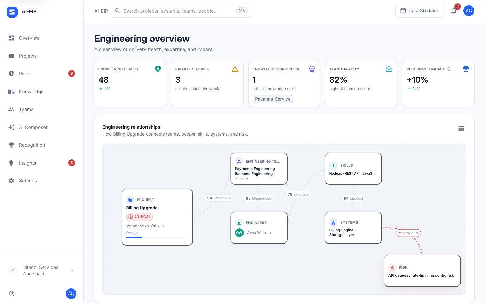
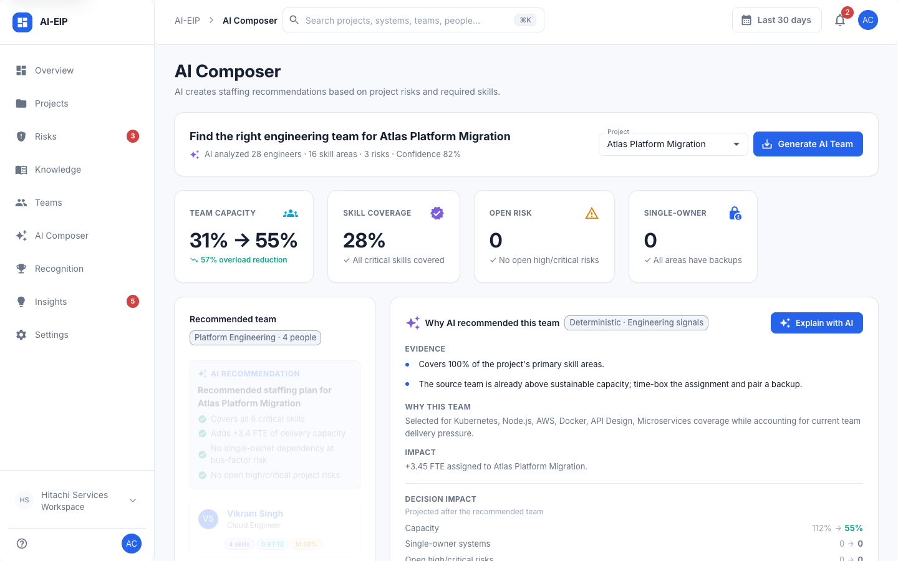
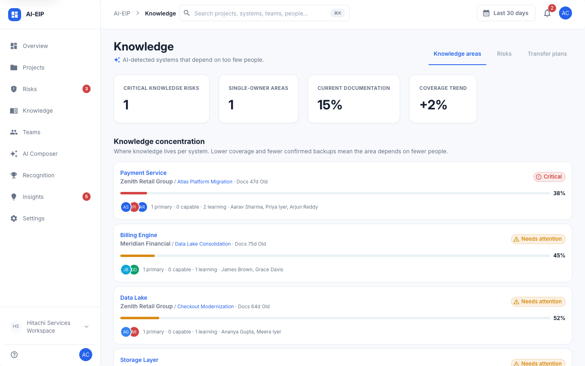
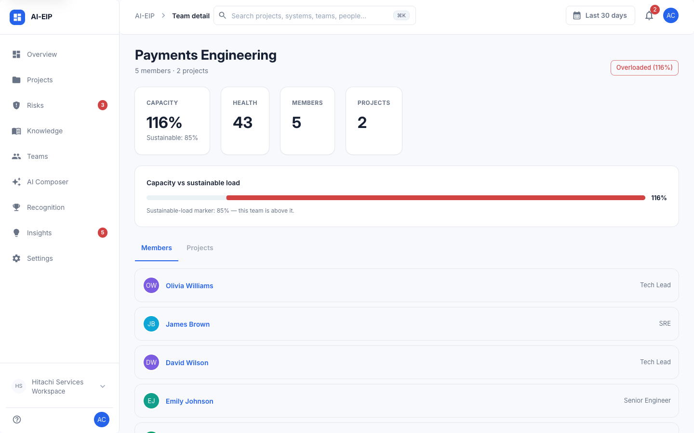

# AI-EIP — AI Engineering Intelligence Platform

AI-EIP is an engineering intelligence platform that helps engineering leaders identify project risks, knowledge gaps, and team capacity issues by analyzing signals across the software development lifecycle.

The platform is **deterministic-first**: risk scores, knowledge-concentration metrics, and team-capacity analysis are computed from engineering signals offline and are fully explainable. An optional AI reasoning layer explains findings, summarizes evidence, and recommends actions — grounded strictly in the deterministic results, never overriding them.

## Problem

Engineering organizations generate signals across many tools:

- source control
- project tracking
- documentation
- incident management
- team and skill data

These signals are fragmented across systems, making it difficult to identify delivery risks, knowledge dependencies, and capacity issues **before they impact execution**. Engineering leaders often discover problems only after delivery has already suffered.

## Why AI-EIP

Traditional engineering dashboards show metrics. AI-EIP focuses on engineering **decisions**:

| Traditional dashboard | AI-EIP |
|----------------------|--------|
| Health score: 56 | **Why** is it risky? |
| Delivery confidence: 52% | **What evidence** supports it? |
| Coverage: 38% | **What action** should be taken? |

Every number in AI-EIP is traceable to the signals that produced it and connected to a recommended action — not just a metric on a screen.

## Architecture

AI-EIP is a layered architecture: engineering signals → deterministic intelligence engines → (dashboard data | AI reasoning).

```
                    React Web Application
                            |
                     Backend API Layer
                            |
   Deterministic Intelligence    |    AI Reasoning Layer
   (Risk · Knowledge · Team      |    (explains · summarizes ·
    engines + insight synthesis) |     recommends)
                            |
                  Engineering Signal Layer
                  (Canonical Signal Store)
```

The backend is a **modular monolith**: each domain owns its `routes → controller → service → repository` in one folder, sharing a single runtime and database. See:

- [`ARCHITECTURE.md`](./ARCHITECTURE.md) — architecture principles, components, and evolution path
- [`SYSTEM_DESIGN.md`](./SYSTEM_DESIGN.md) — frontend/backend design, API contracts, database model, AI pipeline, deployment

## Key Architecture Decisions

- Deterministic calculations remain the source of truth.
- AI is used only for explanation and recommendations.
- AI failures never impact core functionality.
- Every insight is backed by engineering evidence.

## Repository structure

```
ai-eip/
├── frontend/   # React 19 + Vite + MUI SPA
├── backend/    # Node.js + Express API (modular monolith, SQLite)
├── docs/       # Specs, integration plans, screenshots
├── ARCHITECTURE.md
└── SYSTEM_DESIGN.md
```

## Tech stack

| Layer    | Technology |
|----------|------------|
| Frontend | React 19, Vite, MUI, Recharts, Zustand, React Router v7, axios |
| Backend  | Node.js, Express, better-sqlite3 (SQLite → PostgreSQL/Supabase planned) |
| AI       | Provider abstraction — OpenRouter (current), xAI Grok (supported); runtime toggle; deterministic fallback |
| Tests    | `node --test` (analytics engines, skill matcher, LLM provider, API integration) |

## Getting started

### 1. Backend

```bash
cd backend
npm install
npm run db:seed   # create/reset the demo database
npm run dev       # API on http://localhost:4000
```

Configuration lives in `backend/.env` (see `backend/.env.example`). The app runs fully offline with default settings.

### 2. Frontend

```bash
cd frontend
npm install
npm run dev       # UI on http://localhost:5173 (proxies /api → :4000)
```

For a production build: `npm run build` then `npm run preview`. Lint with `npm run lint` (oxlint).

### 3. Optional: enable the AI reasoning layer

The demo is complete without AI. To enable the LLM explanation layer:

```text
# backend/.env
AI_ENABLED=true
AI_PROVIDER=openrouter        # current provider (see .env.example for xAI)
OPENROUTER_API_KEY=...
```

AI is user-triggered only — nothing calls the LLM on page load. Every AI response is labeled with its source (`✦ AI · model` vs `Deterministic · Engineering signals`), and any provider failure falls back to the deterministic result.

## Features

- **Engineering Overview** — portfolio health, at-risk projects, critical knowledge risks, team pressure
- **Projects** — health, delivery confidence, risk drivers with cited evidence, trend
- **Risks** — risk register with probability/impact/urgency scores and prevention actions
- **Knowledge** — coverage, documentation freshness, single-owner detection, transfer plans
- **Teams** — capacity, delivery pressure, skill coverage, risk exposure
- **AI Composer** — evidence-based team recommendations considering skills, capacity, and project risks
- **Recognition** — contribution feed with grounded impact statements
- **Insights** — synthesized, evidence-backed findings with optional AI explanations
- **Settings** — runtime AI enable/disable

## Demo Flow

1. Identify risky projects from the Engineering Overview
2. Explore risk evidence and contributing signals
3. Detect knowledge dependencies in critical systems
4. Generate an AI explanation for a project or insight
5. Use the AI Composer to recommend a balanced team
6. Create mitigation actions (transfer plans, backup ownership)

## Screenshots

### Engineering Overview



### AI Composer



### Knowledge Intelligence



### Team Detail



## Testing

```bash
cd backend && npm test
```

## Demo data

The canonical seed (`backend/src/database/seed/seedData.js`) ships a realistic engineering organization: 10 projects, 18 risks, 9 engineering squads (Payments, Frontend, Backend, Platform, Cloud & Infrastructure, Data, QA, SRE, Architecture), 28 people, 28 engineering skills (React, Node.js, AWS, Kubernetes, REST API, and more), 16 knowledge areas, transfer plans, staffing scenarios, and a Payment Service single-owner narrative. A fixed demo date keeps every metric stable across re-seeds.

## Future direction

GitHub/Jira/Wiki/incident connectors, PostgreSQL (Supabase), RAG-based retrieval, and cloud deployment are **extension points** — see [`ARCHITECTURE.md`](./ARCHITECTURE.md#8-mvp-architecture-vs-future-architecture). They are not required for the MVP.